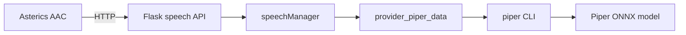

# Asterics Speech (Piper)

Self-hosted text-to-speech helper for [Asterics AAC](https://github.com/asterics/Asterics-AAC). Runs the [Asterics AAC Helper](https://github.com/asterics/Asterics-AAC-Helper) speech API with a [Piper](https://github.com/rhasspy/piper) backend, packaged as a Docker image.

The AAC web app talks to this service over HTTP (default port `5555`) to synthesize speech locally without cloud TTS.

## Quick start

### Pull prebuilt image (recommended)

GitHub Actions publishes `ghcr.io/jubblin/asterics-speech:latest` when speech service files change on `main`/`master`.

```bash
docker compose pull
docker compose up -d
```

### Build locally

```bash
docker compose up --build -d
```

Verify the service is healthy:

```bash
curl http://localhost:5555/voices/
```

Point Asterics AAC at `http://<host>:5555` in speech settings.

## Architecture



At build time, the image clones `Asterics-AAC-Helper` and copies its `speech/` module (Flask app, `speechManager`, caching utilities). This folder adds:

| File | Role |
|------|------|
| `Dockerfile` | Image build: system deps, helper code, Piper model, Python packages |
| `docker-compose.yml` | Local deployment with UK English voice defaults |
| `config.py` | Registers the Piper provider and enables response caching |
| `provider_piper_data.py` | Piper TTS provider implementation |
| `speech_logging.py` | Request, cache, and synthesis timing logs |
| `start_server.py` | Entrypoint; configures logging and binds host/port from env |

## API

Provided by Asterics AAC Helper (not defined in this folder):

| Endpoint | Method | Description |
|----------|--------|-------------|
| `/voices/` | GET | List available voices (also used for health checks) |
| `/speakdata/<text>/` | GET/POST | Return synthesized audio (`application/octet-stream`) |
| `/speakdata/<text>/<providerId>/<voiceId>/` | GET/POST | Synthesize with explicit provider/voice |
| `/speaking/` | GET | Whether speech is in progress |
| `/stop/` | GET/POST | Stop playback |

Text in URLs is lowercased by the helper. With caching enabled, repeated phrases are served from `/app/speech/temp`.

## Configuration

### Runtime environment

| Variable | Default (compose) | Description |
|----------|-------------------|-------------|
| `SPEECH_HOST` | `0.0.0.0` | Bind address |
| `SPEECH_PORT` | `5555` | Listen port |
| `SPEECH_LOG_LEVEL` | `INFO` | Log verbosity (`DEBUG`, `INFO`, `WARNING`, `ERROR`) |
| `CACHE_DATA` | `true` | Cache synthesized audio on disk |
| `PIPER_PROVIDER_ID` | `piper_data` | Provider ID exposed to the AAC app |
| `PIPER_MODEL` | `/models/en_GB-alan-medium.onnx` | Path to ONNX model inside the container |
| `PIPER_VOICE_ID` | `en_GB-alan-medium` | Voice identifier |
| `PIPER_VOICE_NAME` | `UK English (Alan)` | Display name |
| `PIPER_VOICE_LANG` | `en-GB` | BCP 47 language tag |

### Build arguments (Dockerfile)

| Argument | Description |
|----------|-------------|
| `PIPER_MODEL_BASENAME` | Filename stem for the downloaded model |
| `PIPER_MODEL_ONNX_URL` | URL of the `.onnx` voice file |
| `PIPER_MODEL_JSON_URL` | URL of the matching `.onnx.json` config |

### Changing voice

1. Pick a voice from [rhasspy/piper-voices](https://huggingface.co/rhasspy/piper-voices) (`.onnx` + `.onnx.json`).
2. Update `build.args` and matching `PIPER_*` environment variables in `docker-compose.yml`.
3. Rebuild: `docker compose up --build -d`.

Example alternative noted in `docker-compose.yml`: `en_GB-southern_english_female-medium`.

## Provider implementation

`provider_piper_data.py` implements the speech provider contract expected by `speechManager` in Asterics AAC Helper:

- `getProviderId`, `getVoiceType`, `getVoices`, `getSpeakData`

Functions are written in `snake_case` for lint compliance. CamelCase aliases (e.g. `getProviderId = get_provider_id`) are kept because the helper looks up those exact names at runtime.

`get_speak_data` invokes the `piper` CLI, writes output to a temp file via the helper's `util` module, and returns raw audio bytes. The `_voice_id` parameter is unused (single voice per container) but retained for API compatibility.

`constants` and `util` are supplied by the helper code copied into the image at build time, not by this repository.

## Logging

Structured logs go to stdout (view with `docker compose logs -f speech`).

| Layer | What is logged |
|-------|------------------|
| HTTP requests | Method, path, endpoint, spoken text, provider/voice, status, `elapsed_ms` |
| Cache | `cache=HIT` with `elapsed_ms`, or `cache=MISS` with `synth_ms` and `total_ms` |
| Piper | Synthesis duration and output size per phrase |

Example:

```
request GET /speakdata/hello/ endpoint=speakdata text='hello' ... elapsed_ms=820.1
speak cache=MISS synthesis=OK text='hello' ... synth_ms=815.2 total_ms=821.4
piper synthesized text='hello' bytes=12345 elapsed_ms=815.2

request GET /speakdata/hello/ ... elapsed_ms=3.1
speak cache=HIT text='hello' ... elapsed_ms=2.4
```

Set `SPEECH_LOG_LEVEL=DEBUG` in `docker-compose.yml` for more detail.

## CI publish

Workflow: [`.github/workflows/publish-asterics-speech.yml`](.github/workflows/publish-asterics-speech.yml)

- **Trigger:** push to `master` or `main` that touches `Dockerfile`, `docker-compose.yml`, `*.py`, or the workflow file; pull requests build only (no push); manual **workflow_dispatch**
- **Registry:** [GitHub Container Registry](https://docs.github.com/en/packages/working-with-a-github-packages-registry/working-with-the-container-registry)
- **Image:** `ghcr.io/jubblin/asterics-speech` with tags `latest` (default branch), branch name, and commit SHA

After the first publish, set the package visibility to **Public** under the repo’s **Packages** tab if you want anonymous `docker pull` (org default is often private).

## Image hardening

The Dockerfile follows container linting best practices:

- **Pinned apt packages** — `espeak-ng`, `git`, `ca-certificates`, `curl` use version patterns for reproducible Debian bookworm installs.
- **Pinned pip packages** — `flask`, `flask-cors`, `piper-tts` use exact versions.
- **HEALTHCHECK** — probes `http://127.0.0.1:5555/voices/` every 30s (15s start period) so orchestrators can detect a running but unresponsive container.

### Build args required

The Dockerfile downloads the Piper model at build time. Pass build args via `docker compose build` or explicitly:

```bash
docker build -f Dockerfile . \
  --build-arg PIPER_MODEL_BASENAME=en_GB-alan-medium \
  --build-arg PIPER_MODEL_ONNX_URL=https://huggingface.co/rhasspy/piper-voices/resolve/main/en/en_GB/alan/medium/en_GB-alan-medium.onnx \
  --build-arg PIPER_MODEL_JSON_URL=https://huggingface.co/rhasspy/piper-voices/resolve/main/en/en_GB/alan/medium/en_GB-alan-medium.onnx.json
```

Plain `docker build` without these args fails at the model download step.

## Quality checks

From the repo root (see also `CLAUDE.md` **Health Stack**):

```bash
# Docker image lint
hadolint Dockerfile
checkov -f Dockerfile

# Python syntax
python3 -m py_compile *.py
```

Known checkov finding: `CKV_DOCKER_3` (container runs as root). Acceptable for local/LAN use; add a non-root `USER` before production hardening.

Run `/health` (gstack) for a scored dashboard and trend tracking.

## Volumes

- `piper-cache` (compose) → `/app/speech/temp` — persisted TTS cache across restarts.
